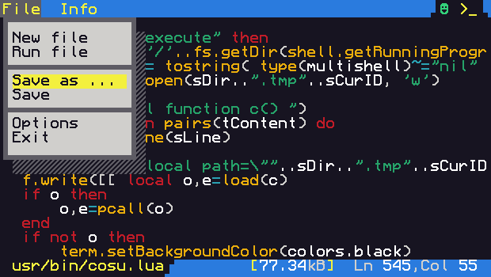

<p align="center">
  
</p>

<h1 align="center">CONSULT | cosu</h1>
<b align="center">A Lua editor that provides a modern user interface for CraftOS <i>(and anything based on it)</i>.</b>

About
-----
CONSULT is designed to run on as many platforms related to CraftOS as possible! It's compatible with non-advanced PCs, LevelOS, CCEmuX, CraftOS-PC and of course with CC:T too. CONSULT tries to provide a faster workflow. </br>
<p align="center"> </p>

Installation
------------
To install CONSULT, run the following command to download the cosu.lua file:
```sh
wget https://github.com/1Turtle/consult/releases/latest/download/cosu.lua
```
> 👉 For the standard user experience, nothing except the above command needs to be set up in advance + it is completely portable!

How to use or modify?
---------------------
~~To find out more, check out the [wiki section](https://github.com/1Turtle/consult/wiki)!~~
